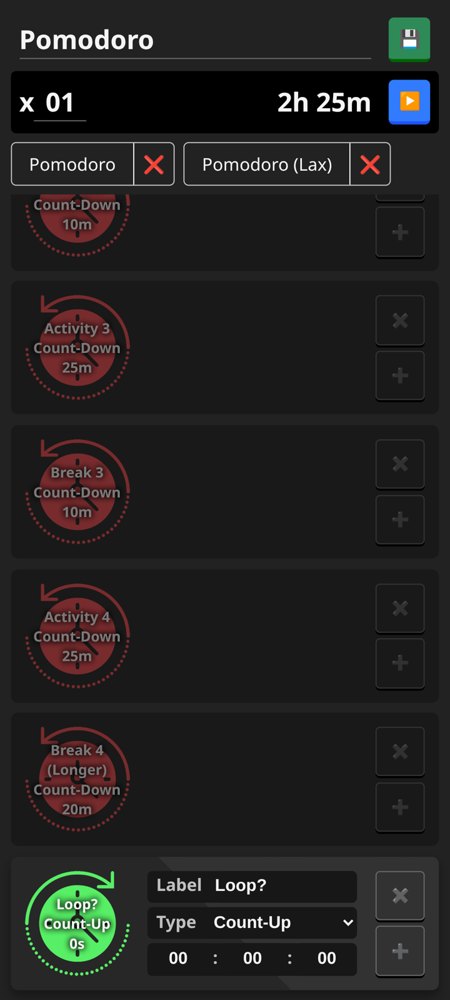

# **TimeSequencer**
A simple web app to compose timer routines and log time usage.

### **Features**

- Create custom timer routines
- Skip, pause and resume timers mid sequence
- Play sound on timeout, show notification when unfocused
- Log each timer life-cycle event for information on time usage

### **Usage**

- [Access it on GitHub Pages](https://rvcalisto.github.io/timeSequencer/)
- Or download it as a zip and open `index.html` with your browser.